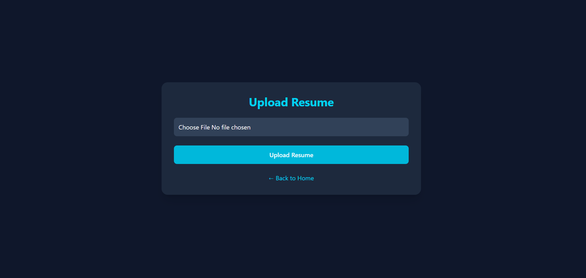
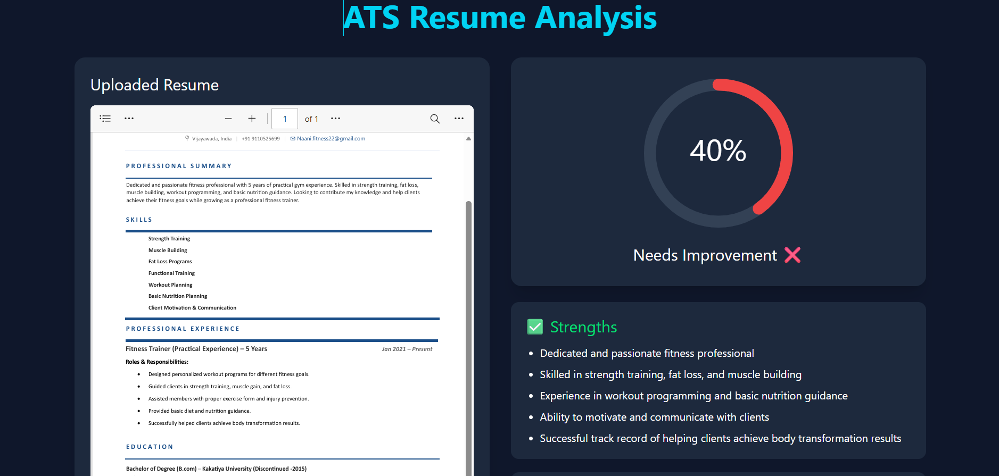

# 🚀 AI Resume Analyzer

An AI-powered Resume Analyzer built using React.js, FastAPI, MongoDB, and Groq LLM. The application analyzes resumes, calculates ATS scores, identifies strengths and weaknesses, suggests improvements, generates interview questions, predicts company-wise job match, and creates downloadable PDF reports.

---

## 📌 Features

- 🔐 User Authentication (Login & Register)
- 📄 Resume Upload (PDF)
- 👀 Resume Preview
- 🤖 AI Resume Analysis
- 📊 ATS Score
- ✅ Strengths Detection
- ❌ Weaknesses Detection
- 📚 Missing Skills
- 💡 Resume Improvement Suggestions
- 🎤 AI Interview Questions
- 🏢 Company-wise Job Match
- 📈 Resume Analytics
- 📥 PDF Report Download

---

## 🛠 Tech Stack

### Frontend
- React.js
- Vite
- Tailwind CSS

### Backend
- FastAPI
- Python

### Database
- MongoDB

### AI
- Groq LLM API

### Authentication
- JWT Authentication

---

## 📂 Project Structure

AI-Resume-Analyzer

├── backend

├── frontend

└── README.md

---

## ⚙️ Installation

### Clone Repository

```bash
git clone https://github.com/YOUR_USERNAME/AI-Resume-Analyzer.git
```

### Backend

```bash
cd backend

pip install -r requirements.txt

python -m uvicorn main:app --reload
```

### Frontend

```bash
cd frontend

npm install

npm run dev
```

---

## 🔑 Environment Variables

Create a `.env` file inside the backend folder.

```env
MONGO_URL=your_mongodb_connection_string
GROQ_API_KEY=your_groq_api_key
JWT_SECRET=your_secret_key
```

---

## 📸 Screenshots

Add screenshots of

- Home Page
- Login
- Upload Resume
- Dashboard
- ATS Score
- AI Job Match
- Resume Analytics
- PDF Report

---

## 🎯 Future Enhancements

- Resume vs Job Description Matching
- AI Cover Letter Generator
- LinkedIn Profile Analyzer
- Multi-language Resume Analysis
- Resume Templates
- AI Career Roadmap

---
## 📸 Project Screenshots

### 🏠 Home Page


### 🔐 Login Page


### 📄 Upload Resume



### 📊 Dashboard


### 📑 PDF Report



## 👨‍💻 Author

**Yaswanth Prakash**

GitHub: https://github.com/TAMMISETTI7344
